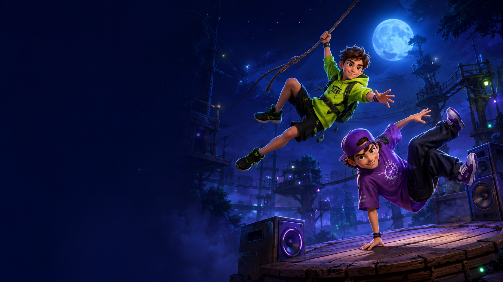

# KosterBro's — The Birthday Quest

Een neon arcadegame voor de verjaardag van Epke (12, survivalrun) en Tieme (10, breakdance). Eén complete run van 90 seconden: survivalpark → Beat Street → verjaardagsfeest.



## Direct spelen

Vereist Node.js 22.18 of nieuwer.

```sh
npm ci
npm run dev -- --port 3000
```

Open **http://localhost:3000/**. Op Windows kun je na installatie ook dubbelklikken op **START-SPEL.cmd**.

## Op een tablet

1. Verbind computer en tablet met hetzelfde wifinetwerk.
2. Stop een eventueel draaiende lokale server. Start `npm run tablet` op de computer.
3. Open op de tablet `http://<lokaal-IP-van-de-computer>:3000`. Gebruik hiervoor het lokale IPv4-adres, niet `localhost`. Sta zo nodig toegang op je privénetwerk toe in de firewall van de computer.

De game is gebouwd voor twee duimen: **groen links springt met Epke; paars rechts spint met Tieme**. De knoppen reageren meteen bij aanraken. Je wisselt vanzelf naar de juiste broer. Liggend zie je meer van het parcours, maar staand werkt ook. Het speelveld en de knoppen passen samen op het scherm. Draaien of de browser verlaten pauzeert de run.

Op een toetsenbord: **spatie / ↑ / W** = springen, **X / ↓ / S** = spinnen, **Escape / P** = pauze, **M** = geluid, **Enter** = start. Tik of druk per hindernis opnieuw.

## De eerste versie

- Drie gebieden, drie gedeelde levens en een verjaardagsoverwinning.
- Boomstammen, touwringen, beatblokken en sterren.
- Combo's, puntenvermenigvuldiger, tijdelijk schild en lokaal opgeslagen record.
- Originele gesynthetiseerde muziek en effecten, met geluidsknop.
- Pauze, uitleg, herstart en optioneel volledig scherm.
- Alle spelbeelden en geluiden zijn lokaal; geen accounts of externe diensten nodig tijdens het spelen.

## Belangrijkste bestanden

| Bestand | Aanpassen |
|---|---|
| `game/settings.ts` | Levens, snelheid, rondeduur, sprongkracht, spin, punten en gebieden |
| `game/core.ts` | Parcours, botsingen, combo's en spelregels |
| `game/renderer.ts` | Spelwereld, personages en effecten |
| `game/audio.ts` | Muziek en geluiden |
| `app/page.tsx` | Schermen, bediening en teksten |
| `app/globals.css` | Tabletindeling en vormgeving |

## Controleren

```sh
npm test
npm run check
npm run lint
npm run build
```

De speltests controleren onder andere volledige runs op 30, 60 en 120 FPS, verlies, verkeerde moves, pauzeren en opnieuw starten. Voor een reproduceerbare browsertest: open in de ontwikkelversie `/?test=perfect`, tik op start en laat de testfixture normale moves uitvoeren. De fixture verandert geen spelregels en schrijft geen testrecord weg; hij wordt uit de productieversie verwijderd.

Getest in de desktopbrowser met tabletformaten. Fysieke iPad-/Android-apparaten zijn niet afzonderlijk getest. Volledig scherm hangt af van de browser; het spel werkt ook zonder die functie.

## Beelden

`public/keyart.png` is een originele illustratie, gemaakt met de ingebouwde Imagegen-tool. De bewegende gamegraphics en muziek worden door de spelcode getekend en gesynthetiseerd. Zie `ART.md` voor de illustratiebrief.

Deze repository bevat de broncode. De game is hiermee nog niet als openbare website gehost.
